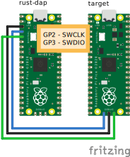

# Raspberry Pi Pico port

## ピン配置



| ピン番号 | ピン名 | SWDピン接続先 | JTAGピン接続先 |
|:--------|:-------|:-------------|:--------------|
| 3       | GND    | GND          | GND           |
| 4       | GPIO2  | SWCLK        | TCK           |
| 5       | GPIO3  | SWDIO        | TMS           |
| 6       | GPIO4  | RESET        | nSRST         |
| 7       | GPIO5  |              | TDO           |
| 9       | GPIO6  |              | TDI           |
| 10      | GPIO7  |              | nTRST         |

## ビルド

### SWD用

デフォルトのfeatureではPIOを使ったSWD用のrust-dapをビルドします。

```
cargo build --release
```

feature `bitbang` を有効にすると、PIOを使ったSWD通信処理ではなく、GPIOをCPUで制御してSWD通信処理を行います。

```
cargo build --release --features bitbang
```

ホストからのクロックレートの設定を有効にするには feature `set_clock` を有効にします。 PIO向けの場合はかなり正確にクロックレートを設定できますが、bitbangの場合はそれなりです。

```
cargo build --release --features set_clock # PIO
cargo build --release --features set_clock,bitbang # bitbang
```

### JTAG用

JTAG用のファームウェアをビルドするには、 `--no-default-featrues` をつけて デフォルトで有効であるSWD機能のfeatureを無効化したうえで、 `jtag` featureを有効にします。

```
cargo build --release --no-default-features --features jtag
```

ホストからのクロックレートの設定を有効にするには feature `set_clock` を有効にします。

```
cargo build --release --no-default-features --features jtag,set_clock
```

## 使い方

### pyOCDを使う場合

#### pyOCDのインストール

```
python3 -m pip install pyocd
```

#### pyOCDの実行とGDB接続

```sh
pyocd gdbserver --target rp2040_core0
```

別のターミナルでgdb実行

Ubuntuのaptで入れられる `gdb-multiarch` だとアーキテクチャの認識に失敗するようなので、[Armのサイトからツールチェインをダウンロード](https://developer.arm.com/downloads/-/gnu-rm) して、その中のGDBを使う。

```sh
arm-none-eabi-gdb <target elf file> -ex "target extended-remote localhost:3333"
```
